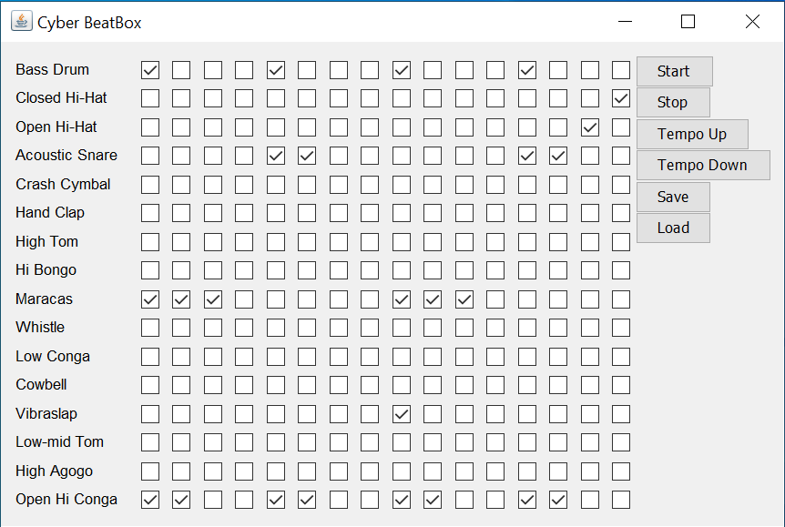

# BeatBox
Virtual beatbox sequencer. (See source code for full documentation)

1. Uses the following imports to create a virtual beatbox. Instruments are derived from the MIDI package and the GUI is implemented using Swing.

```java
import java.awt.*;
import javax.swing.*;
import javax.sound.midi.*;
import java.util.*;
import java.awt.event.*;
import java.io.*;
```

2. Users may create their custom beats as well as save and restore previous tracks.


# What I Learned
- File I/O
- De/serialization
- Exception Handling
