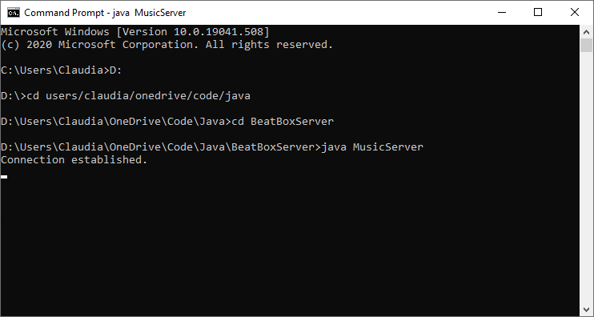
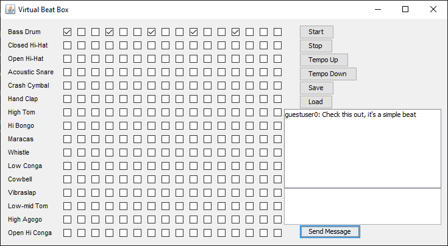
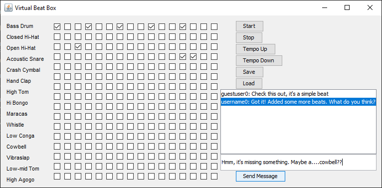

# BeatBox
Virtual beatbox sequencer. (See **source code** for full documentation)

# How To Use It
- Create, save, and load tracks
- Chat with other users
- Share your creations
- Load other people's creations

# How It Works
1. Establishes a connection by running the server application (MusicServer.java) on a terminal. Terminal waits until client application establishes a connection.

2. Run on a separate terminal, users create a track and send a message via client application (BeatBox.java). Attached to their chat messages is their creation.

3. Everyone in the server receives all sent messages, with the ability to click the messages and load other's creations.

# What I Learned
- File I/O
- De/serialization
- Exception Handling
- Client and Server socket connections
